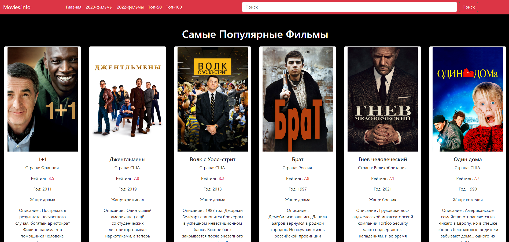

 <h1 style="text-align:center;"> Movies-Info</h1>

 

 <h3><a href="https://mike14112.github.io/Movies-Info/" target="_blank" style="text-decoration:none; color:white;">Link Web site </a> </h3>

Hello! This is an educational project that I wanted to make as close to real projects as possible. I used a  paid API  to practice working with databases, dynamically displaying data, and error handling.  Unfortunately, at the moment,  I can't afford the subscription,and some parts of the project have become static.   However, I continue to develop and learn new technologies, and in the future, I plan to migrate the project to Vue.js."

   <h2> The technologies I used </h2>

<h3>

</h3>

<h2> Installation Guide</h2>

<h3> git clone https://github.com/mike14112/Movies-Info.git </h3>

